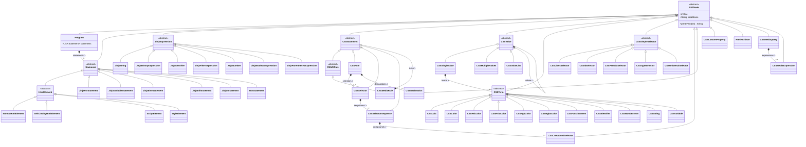

# Jinja / CSS AST Class Diagram

```mermaid
classDiagram
    direction TB

    class ASTNode {
        <<abstract>>
        +int line
        +String nodeName
        +prettyPrint(int) String
    }

    class Program {
        +List~Statement~ statements
    }

    class Statement {
        <<abstract>>
    }

    class JinjaExpression {
        <<abstract>>
    }

    class CSSStatement {
        <<abstract>>
    }

    class CSSValue {
        <<abstract>>
    }

    class CSSTerm {
        <<abstract>>
    }

    class CSSSimpleSelector {
        <<abstract>>
    }

    ASTNode <|-- Program
    ASTNode <|-- Statement
    ASTNode <|-- JinjaExpression
    ASTNode <|-- CSSStatement
    ASTNode <|-- CSSValue
    ASTNode <|-- CSSTerm
    ASTNode <|-- CSSSimpleSelector
    Program *-- "0..*" Statement : statements >

    class HtmlElement {
        <<abstract>>
    }
    Statement <|-- HtmlElement
    HtmlElement <|-- NormalHtmlElement
    HtmlElement <|-- SelfClosingHtmlElement
    HtmlElement <|-- ScriptElement
    HtmlElement <|-- StyleElement

    class JinjaForStatement
    class JinjaVariableStatement
    class JinjaElseStatement
    class JinjaElifStatement
    class JinjaIfStatement
    class TextStatement

    Statement <|-- JinjaForStatement
    Statement <|-- JinjaVariableStatement
    Statement <|-- JinjaElseStatement
    Statement <|-- JinjaElifStatement
    Statement <|-- JinjaIfStatement
    Statement <|-- TextStatement

    class JinjaString
    class JinjaBinaryExpression
    class JinjaIdentifier
    class JinjaFilterExpression
    class JinjaNumber
    class JinjaBooleanExpression
    class JinjaParenthesesExpression

    JinjaExpression <|-- JinjaString
    JinjaExpression <|-- JinjaBinaryExpression
    JinjaExpression <|-- JinjaIdentifier
    JinjaExpression <|-- JinjaFilterExpression
    JinjaExpression <|-- JinjaNumber
    JinjaExpression <|-- JinjaBooleanExpression
    JinjaExpression <|-- JinjaParenthesesExpression

    class CSSAtRule {
        <<abstract>>
    }
    class CSSRule
    class CSSSelector
    class CSSSelectorSequence
    class CSSMediaRule

    CSSStatement <|-- CSSAtRule
    CSSStatement <|-- CSSRule
    CSSStatement <|-- CSSSelector
    CSSStatement <|-- CSSSelectorSequence
    CSSAtRule <|-- CSSMediaRule
    CSSSelector *-- "0..*" CSSSelectorSequence : sequences >

    class CSSCompoundSelector
    class CSSClassSelector
    class CSSIdSelector
    class CSSPseudoSelector
    class CSSTypeSelector
    class CSSUniversalSelector

    ASTNode <|-- CSSCompoundSelector
    CSSSimpleSelector <|-- CSSClassSelector
    CSSSimpleSelector <|-- CSSIdSelector
    CSSSimpleSelector <|-- CSSPseudoSelector
    CSSSimpleSelector <|-- CSSTypeSelector
    CSSSimpleSelector <|-- CSSUniversalSelector
    CSSSelectorSequence *-- "0..*" CSSCompoundSelector : compounds >

    class CSSSingleValue
    class CSSMultipleValues
    class CSSValueList
    class CSSCalc
    class CSSColor
    class CSSHslColor
    class CSSHslaColor
    class CSSRgbColor
    class CSSRgbaColor
    class CSSFunctionTerm
    class CSSIdentifier
    class CSSNumberTerm
    class CSSString
    class CSSVariable

    CSSValue <|-- CSSSingleValue
    CSSValue <|-- CSSMultipleValues
    CSSValue <|-- CSSValueList
    CSSTerm <|-- CSSCalc
    CSSTerm <|-- CSSColor
    CSSTerm <|-- CSSHslColor
    CSSTerm <|-- CSSHslaColor
    CSSTerm <|-- CSSRgbColor
    CSSTerm <|-- CSSRgbaColor
    CSSTerm <|-- CSSFunctionTerm
    CSSTerm <|-- CSSIdentifier
    CSSTerm <|-- CSSNumberTerm
    CSSTerm <|-- CSSString
    CSSTerm <|-- CSSVariable
    CSSSingleValue *-- "0..*" CSSTerm : terms >
    CSSValue *-- "0..*" CSSValue : values >

    class CSSDeclaration
    class CSSCustomProperty
    class HtmlAttribute
    class CSSMediaQuery
    class CSSMediaExpression

    ASTNode <|-- CSSDeclaration
    ASTNode <|-- CSSCustomProperty
    ASTNode <|-- HtmlAttribute
    ASTNode <|-- CSSMediaQuery
    ASTNode <|-- CSSMediaExpression
    CSSRule *-- "0..*" CSSSelector : selectors >
    CSSRule *-- "0..*" CSSDeclaration : declarations >
    CSSMediaQuery *-- "0..*" CSSMediaExpression : expressions >
    CSSMediaRule *-- "0..*" CSSStatement : rules >
```