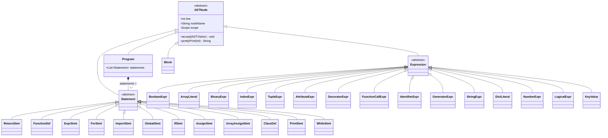

# Python / Flask AST Class Diagram

```mermaid
classDiagram
    direction TB

    class ASTNode {
        <<abstract>>
        +int line
        +String nodeName
        -Scope scope
        +accept(ASTVisitor) void
        +prettyPrint(int) String
    }

    class Program {
        +List~Statement~ statements
    }

    class Statement {
        <<abstract>>
    }

    class Expression {
        <<abstract>>
    }

    class Block

    ASTNode <|-- Program
    ASTNode <|-- Statement
    ASTNode <|-- Expression
    ASTNode <|-- Block
    Program *-- "0..*" Statement : statements >

    class ReturnStmt
    class FunctionDef
    class ExprStmt
    class ForStmt
    class ImportStmt
    class GlobalStmt
    class IfStmt
    class AssignStmt
    class ArrayAssignStmt
    class ClassDef
    class PrintStmt
    class WhileStmt

    Statement <|-- ReturnStmt
    Statement <|-- FunctionDef
    Statement <|-- ExprStmt
    Statement <|-- ForStmt
    Statement <|-- ImportStmt
    Statement <|-- GlobalStmt
    Statement <|-- IfStmt
    Statement <|-- AssignStmt
    Statement <|-- ArrayAssignStmt
    Statement <|-- ClassDef
    Statement <|-- PrintStmt
    Statement <|-- WhileStmt

    class BooleanExpr
    class ArrayLiteral
    class BinaryExpr
    class IndexExpr
    class TupleExpr
    class AttributeExpr
    class DecoratorExpr
    class FunctionCallExpr
    class IdentifierExpr
    class GeneratorExpr
    class StringExpr
    class DictLiteral
    class NumberExpr
    class LogicalExpr
    class KeyValue

    Expression <|-- BooleanExpr
    Expression <|-- ArrayLiteral
    Expression <|-- BinaryExpr
    Expression <|-- IndexExpr
    Expression <|-- TupleExpr
    Expression <|-- AttributeExpr
    Expression <|-- DecoratorExpr
    Expression <|-- FunctionCallExpr
    Expression <|-- IdentifierExpr
    Expression <|-- GeneratorExpr
    Expression <|-- StringExpr
    Expression <|-- DictLiteral
    Expression <|-- NumberExpr
    Expression <|-- LogicalExpr
    Expression <|-- KeyValue
```